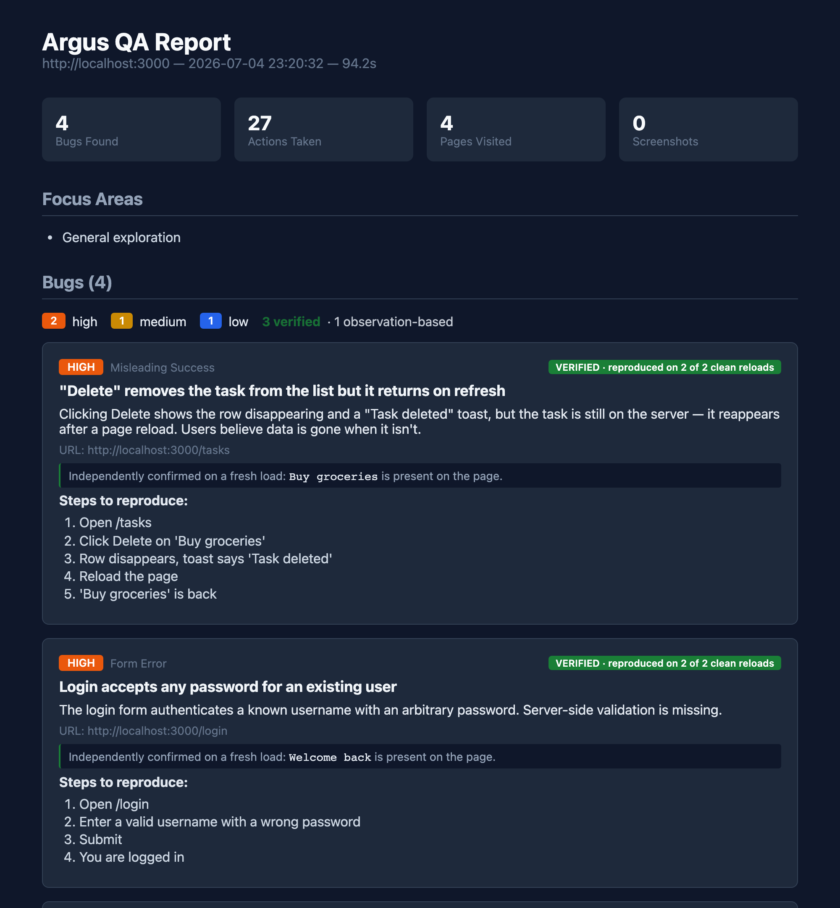
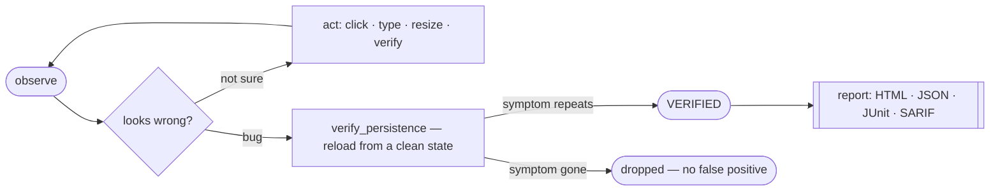

<!-- mcp-name: io.github.chriswu727/argus -->

<div align="center">

# Argus

**Point your coding agent at a web app. It explores like a QA tester and reports the bugs it can prove.**

Argus is an [MCP](https://modelcontextprotocol.io/) server. It adds evidence-first browser QA to Claude Code or any MCP host without taking over the host agent's identity or broader coding task. The agent explores, inspects, verifies persistence, and records reproducible bugs. Every certified finding is **independently re-confirmed from a clean page load** before it's reported.

[](https://pypi.org/project/argus-testing/)
[](https://pypi.org/project/argus-testing/)
[](https://modelcontextprotocol.io/)
[](#benchmarks)
[](LICENSE)

[Quick start](#quick-start) · [Why Argus](#why-argus-is-different) · [Compared](#how-it-compares) · [Tools](#tool-surface) · [Benchmarks](#benchmarks)

</div>

---

## The output

Give it a URL; get a report of bugs — each tagged with whether Argus **independently reproduced it** or only observed it:

<div align="center">

</div>

The green badge is the whole point. Anyone can have an LLM *claim* a bug. Argus re-loads the page from scratch and re-checks the symptom before it says **VERIFIED** — so the report is a list of bugs you can trust, not a list of guesses to triage.

---

## How it works



The agent is the intelligence. Argus supplies concise QA guidance, a description-keyed tool surface (`click_what("Login button")`, not `click(7)`), and a **reproduction-receipt engine** that turns "the model thinks this is a bug" into "this bug is real, here's the proof."

---

## Quick start

```bash
pip install argus-testing
playwright install chromium

# Wire it into Claude Code (or Cursor, or any MCP host)
claude mcp add argus -- argus-mcp
```

The default `core` profile exposes the primary web-testing workflow without flooding the host with every specialist tool. Use `argus-mcp --list-tools` to inspect the selected profile, `--tool-profile screen` for native macOS testing, or `--tool-profile full` for the entire advanced surface. `ARGUS_TOOL_PROFILE` provides the same setting through the environment.

Then just ask, in your agent session:

> **"Test my app at http://localhost:3000 — find real bugs."**

That's it. The agent drives; Argus keeps it honest and writes the report.

<details>
<summary><b>CLI mode (no MCP host — bring your own LLM)</b></summary>

```bash
# Uses a LiteLLM-backed planner. Set a provider key (OPENAI_API_KEY, DEEPSEEK_API_KEY, …).
argus http://localhost:3000 --model deepseek/deepseek-chat

# Higher recall: union N independent passes (deduped, proven instance kept)
argus http://localhost:3000 --passes 3
```

</details>

<details>
<summary><b>Screen mode (macOS) — test any native app, not just the web</b></summary>

```bash
pip install 'argus-testing[mac]'
brew install cliclick          # keystroke / coordinate fallback
argus-mcp --doctor             # check Screen Recording + Accessibility grants
claude mcp add argus-screen -- argus-mcp --tool-profile screen
```

Same description-keyed tools, but the target is whatever app is foreground on macOS — Notes, Cursor, Safari, your in-progress feature. No headless Chrome, no scripted Playwright. Argus sees what you see, via the Accessibility tree.

</details>

---

## Why Argus is different

**Existing testing tools only test what you script.** Playwright and Cypress run the assertions you wrote. Argus *discovers* bugs you didn't think to test for — and then does the thing an LLM alone can't be trusted to do: **proves them.**

| | |
|---|---|
| **Autonomous & black-box** | You give it a URL, not a test plan. It explores like a real user — no repo access, no scripted steps. |
| **Reproduction receipts** | Before certifying a bug, it re-loads the page from a clean state and re-confirms the symptom. Engineered for **zero false-certifications.** |
| **Finds human-eye bugs** | Fake "Only 3 left!" scarcity, a "Saved" toast that doesn't save, a sale badge where the price didn't drop, a stale navbar after a rename. Static analysis catches none of these. |
| **Discover → guard** | Findings are journaled; `argus-regression` re-checks them on every build with **zero LLM cost** and a non-zero exit — a real CI gate against known bugs coming back. |
| **Machine-readable** | Every report also emits JSON, JUnit, and SARIF — so findings gate a pipeline and surface as inline **GitHub PR annotations.** |

---

## How it compares

On the axis that matters for finding bugs — *autonomously discover, independently verify, and report* — Argus occupies a different slot from the browser-MCP crowd:

| | **Argus** | Playwright MCP | Chrome DevTools MCP | browser-use |
|---|:---:|:---:|:---:|:---:|
| Autonomously finds unknown bugs | Yes | No *(driver)* | No *(debugger)* | Partial *(task-scoped)* |
| Independently verifies each finding | Yes *(receipt)* | No | No | No *(LLM score)* |
| Evidence-rich bug report | Yes | No | No | Partial |
| Black-box (no repo / source access) | Yes | Yes | Yes | Yes |
| Zero-LLM CI regression gate | Yes | Partial | No | Partial |

> These aren't "worse" tools — they're a different job. Playwright MCP gives an agent excellent hands; Chrome DevTools MCP gives it deep network/perf/memory inspection Argus doesn't have. Argus is the layer that *decides what's a bug and proves it.* Use them together.

---

## Benchmarks

```
$ python -m argus.bench --target all

  buggytasks    22 / 22  = 100 %   ·  mechanical bugs (console errors, fake delete, auth bypass…)
  darkshop      12 / 12  = 100 %   ·  human-eye bugs (fake scarcity, lying toasts, stale state…)
  ──────────────────────────────────────────────────────────────────────
  total         34 / 34  = 100 %   ·  reproducible from git clone in two commands
```

`34 / 34` is the **capability ceiling** — what's *findable* through the tool surface, measured by deterministic scripts. It is deliberately separate from *how often a given LLM remembers to use the tools well*, which is noisy and honestly reported below.

<details>
<summary><b>Real-LLM recall — the honest number (and why we report the spread)</b></summary>

`python -m argus.bench.agent_runner` puts an **actual model** in the driver's seat and scores recall across trials. What we've learned running it:

1. **Real recall sits well below the `34/34` ceiling.** A live driver finds a fraction of the seeded bugs per pass — the ceiling is what's *findable*, this is what a model *finds*.
2. **Variance is large — never rank models on a few runs.** Per-trial recall swings widely; we report the spread, not a single hero number.
3. **Dogfooding the bench found real bugs in Argus itself** — a `record_bug` crash on a string argument that silently dropped findings, resolver misses on common phrasings. The tool-testing tool got tested.
4. **Precision holds regardless of driver.** Across every trial, the reproduction receipt kept false-certifications at zero — a weak model finds fewer bugs, but the ones marked VERIFIED are still real.

</details>

<details>
<summary><b>What the fixtures seed</b></summary>

**BuggyTasks** (`:5555`) — 22 mechanical bugs in a task app: console errors, dead links, fake delete (UI says "deleted!" but data persists on refresh), auth bypass, NaN dates, off-by-one counts, race conditions. The "scripted E2E could find these" tier.

**DarkShop** (`:5556`) — 12 human-eye bugs in a polished-looking store: hardcoded "Only 3 left!" scarcity, `-50%` badges where sale price equals original, a "free shipping over $50" banner contradicted by a flat `$5` at checkout, inverted visual hierarchy ("Add to Cart" demoted under a prominent "Subscribe"), cross-page state drift (rename sticks on /account, navbar greeting doesn't). **Static analysis catches roughly none of these** — they require an agent that reads the page and *reasons.*

```bash
python test-site/app.py           # BuggyTasks  :5555
python human-eye-fixture/app.py   # DarkShop    :5556
python -m argus.bench --target all
```

</details>

---

## Tool surface

`argus-mcp` starts with the focused `core` web profile. The tables below describe the wider surface; start with `--tool-profile full` only when you need specialist network, storage, tab, coordinate, or crawl controls. Screen mode has its own focused profile.

<details>
<summary><b>Web mode</b> — the description-keyed toolset the agent drives</summary>

| Tool | Purpose |
|------|---------|
| `start_session(url, review_mode=...)` | Start `exploratory`, `visual`, or `regression` review and return the initial observation immediately. |
| `observe()` | URL + title + interactive elements (keyed by description, not indices) + counts + visible feedback + ARIA tree + viewport state. |
| `click_what(description)` | Click the element best matching `description`. Returns candidates if ambiguous, rather than guessing. |
| `type_into` / `select_into` / `paste_into` | Resolve an input by description, then type / choose / paste (paste fires a real `ClipboardEvent`). |
| `verify_persistence(expect, target_text, after_url)` | Force a fresh GET and report whether `target_text` is present or absent. **The "Saved!" toast is not proof; this is.** |
| `record_bug(title, severity, evidence, verify=...)` | Called once the agent confirms a real bug. Verify text with `{expect, target_text, at_url}`, or a broken response with `{expect_status: 404, at_url}`. |
| `record_observation(title, evidence, category)` | Keep qualitative visual, usability, content, responsive, or accessibility evidence separate from reproducible bugs. |
| `press_key` · `click_at` / `type_at` / `hover_at` / `drag_at` | Keyboard chords; and coordinate actions — the escape hatch for canvas/WebGL and mouse-drag lists with no DOM marker. |
| `resize(w,h)` · `emulate_device(name)` · `emulate_media(scheme)` | Responsive breakpoints; true device emulation (touch, mobile UA, DPR, state carried over); dark mode / reduced motion. |
| `upload_file` / `drop_file` · `get_downloads()` | Upload via a real `<input>` or a dropzone; inspect downloaded bytes — catch a broken CSV/PDF/XLSX export. |
| `tabs_list` / `tabs_switch` / `tabs_close` | Multi-tab flows — OAuth, payment popups, open-in-new-tab. |
| `network_mock(pattern, …)` | Return 5xx/401/malformed for a URL pattern — fault injection with no backend. |
| `inspect_element` · `check_layout` | Inspect interactive or visible non-interactive content; return bounded overflow, clipping, small-target, and overlay signals. |
| `screenshot` · `screenshot_diff` | Wait for finite CSS transitions, then return an MCP image plus its absolute evidence path; pixel diff includes a red-tint overlay. |
| `eval_js` · `get_errors` | JS (opt-in) and drained console + network events. Events keep their originating page and correlated console/network symptoms attach to one root-cause finding. |
| `end_session()` | Close the session, write the report (HTML + JSON + JUnit + SARIF). |

</details>

Reports keep original screenshots as evidence and, by default, write compact WebP previews under `report-assets/` instead of base64-embedding every full-size PNG into the HTML. Set `ARGUS_PORTABLE_REPORT=1` when a single self-contained HTML file is more important than size. JSON output includes complete reproduction receipts, review mode, tool-call and recorded-step counts, screenshot metadata, and qualitative observations. JUnit suite failure totals match the emitted `<failure>` nodes.

<details>
<summary><b>Screen mode (macOS)</b> — same idea, against native apps</summary>

| Tool | Purpose |
|------|---------|
| `start_screen_session(target_app="")` | Bind to the foreground or a named app. Refuses cleanly with deep-link permission instructions if grants are missing. |
| `screen_observe()` | Foreground app + window title + AX tree (capped) + screen-coords per element + screenshot. |
| `screen_click_what` / `screen_type_into` / `screen_press_key` | Resolve via the AX tree; act via native accessibility actions, falling back to `cliclick`. |

**Safety:** per-call timeout, a 30-minute session cap, a `~/.argus/abort` panic file that halts every subsequent action, and an automatic before/after screenshot trail on every action.

</details>

---

## Philosophy

<details>
<summary><b>Trust the agent, don't simulate intelligence</b></summary>

Argus assumes an Opus-class driver. Static rules that pretend to *be* the smart layer are subtractive — they add maintenance and false positives and pull attention from what the agent actually saw. So `detector.py` is tiny: it only captures the two channels the agent literally cannot see (the console event stream and the HTTP layer). "Is this toast misleading? Is the visual hierarchy wrong? Is that count off?" — the agent reads `observe()` and decides.

</details>

<details>
<summary><b>Guide the review; don't hijack the host task</b></summary>

The instruction block gives the agent a compact evidence-first ritual and a bug bar, then gets out of the way. Argus remains a capability inside the user's current task: it does not prevent implementation work, replace the host's identity, or imply authority for irreversible external actions.

</details>

<details>
<summary><b>Description-keyed, not index-keyed</b></summary>

`click_what("Login button")`, not `click(7)`. Element indices are a leaky abstraction even within one `observe`. A capable agent describes what it wants by what it *is*, and the resolver maps that to the right element — refusing to misclick on ambiguity rather than guessing.

</details>

---

## Project layout

```
argus/
├── mcp_server.py     # tool surface + role instructions + reproduction-receipt engine
├── browser.py        # Playwright backend: DOM/ARIA extraction, capsule/replay
├── resolver.py       # description → element (web + screen)
├── reporter.py       # HTML + JSON + JUnit + SARIF
├── detector.py       # console + network capture (only)
├── cli.py            # argus (explore) + argus-regression
├── bench/            # deterministic ceiling + real-LLM recall harness
└── screen/           # macOS AX backend, permissions, safety
test-site/            # BuggyTasks  (22 mechanical bugs)
human-eye-fixture/    # DarkShop    (12 human-eye bugs)
```

---

<div align="center">

**MIT licensed** · Built by [Yichen Wu](https://github.com/chriswu727) · Issues and PRs welcome

</div>
